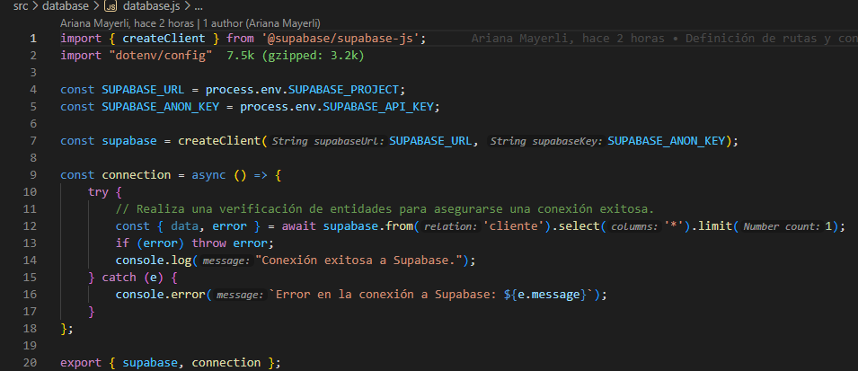
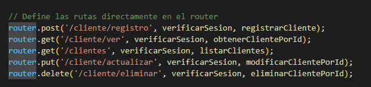
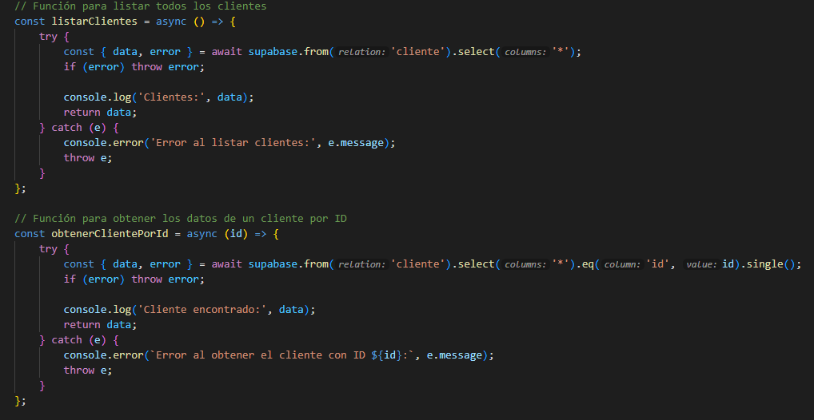

<h1 style="display:flex;justify-content: center;align-content: center; color: deepskyblue;"> Examen de Fin de Carrera - Component Backend </h1>
En este proyecto se presenta el proceso de diagramación, definición, estrcutura y desarrollo del componente backend, de forma generalizada, para emplearlo en diferentes proyectos.

### Introducción al Proyecto

Este proyecto se ha realizado mediante la comunicación entre dos tecnologías de relevancia para el mundo de la programación, como son ExpressJS y Supabase.
A diferencia de Firebase, Supabase es una alternativa relacional (con base en Postgress SQL) para el almacenamiento de datos; además de ofrecer autenticación y base de datos.

### Estructura de archivos

El proyecto se compone de los siguientes archivos y directorios, fundamentales para comprender el funcionamiento tatal del proyecto.

```

└── 📁Backend-JS-Final-Carrera
    └── 📁src
        └── 📁controllers
            └── cliente.controller.js
            └── user.controller.js
            └── pedidos.controller.js
            └── productos.controller.js

        └── 📁database
            └── database.js
            └── 📁models
                └── Cliente.js
                └── Ordenes.js
                └── Productos.js
                └── Usuario.js

        └── index.js

        └── 📁middleware
            └── authVerifier.js

        └── 📁routers
            └── cliente_routes.js
            └── usuarios_routes.js
            └── pedidos_routes.js
            └── productos_routes.js
        └── server.js
        
    └── .env
    └── .gitignore
    └── package-lock.json
    └── package.json
    └── README.md
```
### Despliegue
El servicio ha sido desplegado en Render, para acceder a un servicio en la nube robusto y eficiente. 

El enlace de despliegue es: [https://backend-js-final-carrera.onrender.com](https://backend-js-final-carrera.onrender.com)

### Diagrama de bases de datos

La base de datos posee una estructura sencilla, ligada a las claves primarias y cardinalidades de las diferentes entidades. El mismo sea ha realizado con PostgresSQL y se define de la siguiente manera:


### Construir el proyecto

Para construir el proyecto desde el código fuentes, es necesario contar con Node 18+, Bun (para agilizar la ejecución de scripts y el server) y las variables de entorno de Superbase.

1. Clona el proyecto con el comando  ``git clone <url del repositorio>``.
2. Instala las dependencias con: ``npm install (si usas NodeJS)``.
3. Ejecuta el entorno de desarrollo con ``npm run dev``.

### Comportamiento de rutas y comunicación con la base de datos

- #### Conexión a la base de datos
  - La conexión a la base de datos se realiza mediante la dirección del proyecto, una URL entregada por SUPABASE como identificador primario de los proyectos; y, la API Key asociada al mismo. Esta comunicación se establece a través del cliente proporcionado por la librería de Supabase JS.
   
  
- #### Definición de rutas
  - Las rutas se definen como elementos de comunicación entre un enlace (dirección web) y las funciones asociadas a estas. Con las rutas podemos identificar las diferentes acciones que se realizaron en determinados puntos de la aplicación, ya sea desde un registro o manejo de tokens, a acciones más complejas, como listas de pedidos, etc.

    
- #### Definición de controladores
- Los controladores son las funciones que realizan diferentes acciones y consultas en nuestra aplicación. Desde un registro de cliente a una visualización de datos, la facilidad con la que los controladores agilizan el proceso de programación se limita a la necesidad de la misma. Estos controladores se asocian a una ruta (y a un middleware, si es necesario, para realizar una capa extra de funcionalidad antes de llamar al flujo de trabajo principal).

  
### Pruebas de rendimiento en Apache jMeter
## USUARIO


## CLIENTES


## TECNICO


## PEDIDO


### Documentación de la API 
Para poder visualizar toda la documentación de la API Rest desarrollada, ingresa al siguiente enlace: [Documentación de API](https://backend-js-final-carrera.onrender.com/api/docs)


### Referencias

1. [Documentación de Express](https://expressjs.com/en/guide/routing.html)
2. [Supabase y SQL](https://supabase.com/database)
3. [Documentación de Supabase para Javascript](https://supabase.com/docs/reference/javascript/introduction)
4. [Backend con Supabase y Express](https://medium.com/@heshramsis/building-a-crud-app-with-supabase-and-express-a-step-by-step-guide-for-junior-developers-81456b850910)c
